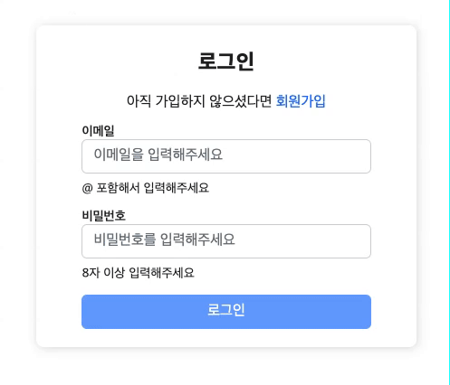
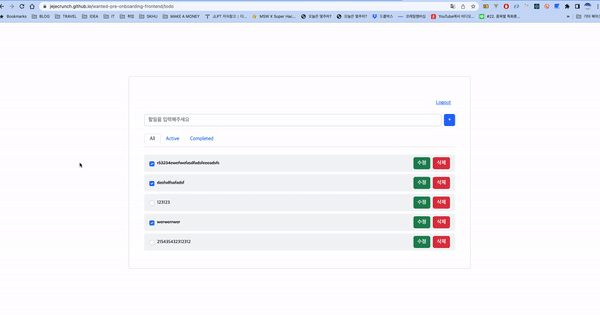

# 원티드 프리온보딩 프론트엔드 선발과제 (10월)
## 📌 https://jejecrunch.github.io/wanted-pre-onboarding-frontend

<br />
<br />

## 로컬에서 접속
.env 파일이 루트 폴더에 있어야 합니다.

1. /.env 파일 생성

```bash
    REACT_APP_API_URL=https://pre-onboarding-selection-task.shop
```

2. 프로젝트 패키지 설치 및 실행

```bash
    npm i && npm start
```

## 구조도
```
📦 src
├─ 📄 index.tsx            # entry / router
├─ 📄 index.scss
├─ 📂 components
│  ├─ 📂 common            # 공통으로 쓰이는 컴포넌트
│  │  ├─ 📂 Button
│  │  ├─ 📂 Input
│  │  └─ 📄 index.ts
│  └─ 📂 Todo              # 투두리스트
│     ├─ 📄 TodoForm.tsx
│     ├─ 📄 TodoItem.tsx
│     ├─ 📄 TodoList.tsx
│     └─ 📄 TodoNav.tsx
├─ 📂 services
│  ├─ 📂 api
│  │  ├─ 📄 todoApi.ts      
│  │  └─ 📄 userApi.ts
│  ├─ 📄 instance.ts       # axios instance
│  ├─ 📄 index.ts       
│  └─ 📄 store.ts          # session storage methods
├─ 📂 hooks
│  ├─ 📄 index.ts          
│  └─ 📄 useInput.tsx      # input 상태 관리
├─ 📂 types
│  └─ 📄 index.d.ts        # 전역 타입 선언
└─ 📂 pages
   ├─ 📂 Main              # 회원가입 / 로그인 페이지
   │  ├─ 📄 Main.scss
   │  └─ 📄 Main.tsx
   └─ 📂 Todo              # 투두 페이지
      ├─ 📄 Todo.scss
      └─ 📄 Todo.tsx
```


## 기능 시연

### 로그인/회원가입



✅ Assignment1

- 이메일과 비밀번호의 유효성 검사기능 구현 (이메일 조건: @ 포함, 비밀번호 조건: 8자 이상)
- 입력된 이메일과 비밀번호가 위 조건을 만족할 때만 버튼 활성화

<br />


✅ Assignment2

- 로그인 성공시 todo 페이지로 리다이렉트
- 응답받은 JWT는 세션 스토리지에 저장

✅ Assignment3

- 로컬 스토리지에 토큰이 있는 상태로 / 페이지에 접속한다면 /todo 경로로 리다이렉트
- 로컬 스토리지에 토큰이 없는 상태로 /todo페이지에 접속한다면 / 경로로 리다이렉트


<br />


### 투두리스트

✅ Assignment4

- /todo경로에 접속하면 투두 리스트의 목록 확인
- 투두 리스트의 내용과 완료 여부 표시
- 입력창과 추가 버튼이 있고, 추가 버튼을 누르면 입력창의 내용이 새로운 투두 리스트로 추가

✅ Assignment5

- 투두 리스트의 수정, 삭제 기능 구현
- 투두 리스트의 개별 아이템 우측에 수정버튼이 존재하고 해당 버튼을 누르면 수정모드가 활성화 및 내용 수정
- 수정모드에서는 개별 아이템의 우측에 제출버튼과 취소버튼이 표시되며 해당 버튼을 통해서 수정 내용을 제출 및 취소
- 투두 리스트의 개별 아이템 우측에 삭제버튼이 존재하고 해당 버튼을 누르면 투두 리스트가 삭제

<br />


📌 추가 구현
- 로그아웃 (로컬 스토리지에서 삭제)


## 성능 최적화


## 사용 라이브러리
    - CRA + typescript
    - react-router-dom: 6.4.2
    - axios : 1.1.3
    - bootstrap : 5.2.2